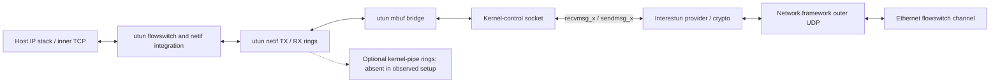

# How the Skywalk utun datapath fits together

Source-only follow-up, 2026-09-29. No interface or channel was opened, attached,
started, or reconfigured; no traffic was generated. Runtime evidence below is
from saved diagnostics, not a new observation of the running system.

The audited XNU revision is `f6217f891ac0bb64f3d375211650a4c1ff8ca1ea`, still
Apple's published `main` when checked. The installed kernel was
`xnu-13432.1.9~1` (macOS 27.0, 26A428). Published source explains the architecture;
it is not an exact source match for this installed kernel.

## Three separate objects

A Skywalk utun netif, its flowswitch, and its optional tunnel-provider
kernel-pipe channels are independently configured. Enabling the first two
need not enable the third. The observed NE interface uses netif and flowswitch,
but zero utun user channels. Its provider reads/writes the control socket.
Network.framework's Ethernet flowswitch channel carries the encrypted outer
UDP packets and is a separate object.

This is a conceptual boundary diagram, not a claim that every host packet
traverses every flowswitch classifier. The netif has host and device ports.
Flowswitch attachment opens kernel channels for both: the device channel
carries data; the host channel activates callbacks that intercept host output.
Kernel channels do not create userspace task mappings. This explains why
`skywalkctl` can list utun channels without our provider mapping them.
[Netif architecture][netif], [flowswitch architecture][flowswitch],
[utun flowswitch attachment][fsattach].

Saved evidence: [startup investigation](apple-packet-tunnel-path.md),
`target/apple-path/reboot-20260928/{interface,channels,provider-fds}.txt`.
The provider's sole `CHAN` FD matched the **en8** flowswitch UUID, not either
utun UUID. The later option readback reported zero user utun channels.
A saved kernel message from `utun_netif_sync_rx` additionally establishes
execution of the utun netif receive code on the installed kernel; flags alone
would have been weaker evidence.

## Host to tunnel: our encrypted UDP send direction

The netif calls this **TX**, even though our provider reads these packets:

1. `utun_netif_sync_tx` consumes packets from the netif TX ring.
2. With no kernel pipe, it allocates an mbuf and uses `mbuf_copyback` to copy
   the packet into it, including the utun family header.
3. `utun_output` enqueues that mbuf as a record in the control socket.
4. The provider reads socket records using `recvmsg_x`, then encrypts and
   submits outer UDP through Network.framework.

There is an explicit packet-to-mbuf conversion copy **inside the kernel**, in
addition to the socket transfer into userspace. Skywalk-native interface flags
do not remove it. The driver records `NETIF_STATS_TX_COPY_MBUF` for this path.
[TX implementation][tx], [socket enqueue][output].

`utun_output` invokes `ctl_enqueuembuf` per packet with `CTL_DATA_EOR`, without
`CTL_DATA_NOWAKEUP`. On successful append, the control layer therefore calls
`sorwakeup` per packet. This is per-packet wakeup *processing*, not evidence
of one actual scheduler wakeup/context switch per packet; readiness and
scheduling can coalesce. Ring draining and userspace reads can still be batched.
[Control receive enqueue][enqueue].

## Tunnel to host: our encrypted UDP receive direction

The netif calls this **RX**, while our provider writes these packets:

1. After UDP reception and decryption, `sendmsg_x` submits inner IP records.
2. `utun_ctl_send` handles each record and passes its mbuf to `utun_pkt_input`.
3. `utun_pkt_input` locks the PCB/input chain, appends the mbuf, and notifies
   the netif RX ring.
4. `utun_netif_sync_rx` drains that chain, allocates netif packets, strips the
   family header, and uses `mbuf_copydata` to copy into netif buflets.
5. The resulting RX ring packets proceed toward the host networking stack.

This is the matching mbuf-to-packet conversion copy, accounted as
`NETIF_STATS_RX_COPY_MBUF`. The saved oversized-packet diagnostic came from
this exact branch, whose published implementation rejects payloads larger
than the packet pool buffer. It is not evidence that the provider was using
the separate kernel-pipe branch of the same function.
[RX implementation][rx], [input chain and notification][input].

### Syscall batching stops short of driver batching

Utun registers `ctl_send`, but **does not register `ctl_send_list`**.
The control layer's list-send fallback loops through the batch, unlocks the
socket, invokes the single-packet callback, and relocks the socket for each
packet. Consequently a 128-packet syscall does not become one utun callback,
one input-chain lock acquisition, or one ring notification.
[Utun registration][register], [control list-send fallback][sendlist].

A true list callback could amortize this work, but that requires a kernel
driver change; there is no socket option that installs one. This observation
does not quantify how much of our measured CPU or throughput it explains.

## Queue options are not interchangeable

| Setting | Actual scope in the audited source |
| --- | --- |
| Application pending packets / Network.framework credits | Our own outstanding work; not utun ring capacity. |
| `SO_RCVBUF` (selected 4 MiB) | Control socket storage for host-to-provider packets; enqueue checks available socket space. |
| `UTUN_OPT_MAX_PENDING_PACKETS` (selected 1024) | Explicit packet-count admission check is in legacy `utun_start`. The netif TX socket fallback does not check it. `utun_ctl_rcvd` still uses it to decide when to reenable output. |
| `net.utun.max_pending_input` (source default 512) | Separate provider-to-host mbuf input-chain threshold. Not changed or read live during this investigation. |
| Netif/flowswitch ring-size readbacks (64/64/128) | Configuration fields, not independent measurement of live mapped geometry or occupancy. |
| Kernel-pipe ring settings | Inactive for the observed zero-channel configuration. |

When `utun_use_netif` is true, setup selects `IFNET_INIT_SKYWALK_NATIVE` and
**does not install `utun_start`**. Thus the successful 1024 option readback
cannot be presented as proof that we enlarged a Skywalk packet queue to 1024.
We retain the setting, but any throughput attribution needs separate evidence.
[Mode selection][connect], [legacy queue checks][legacy], [netif TX][tx],
[separate input limit][input].

## What mapped kernel pipes would change

With kernel pipes allocated, netif TX signals the pipe RX ring instead of
copying packets into socket mbufs. The provider would consume pipe RX and
produce pipe TX. These directions are opposite the netif's TX/RX names.

This bypasses the control-socket boundary, but the published implementation
still uses **different packet pools and explicit payload copies**:

- `utun_kpipe_sync_rx`: netif TX packet to newly allocated kpipe RX packet,
  using `memcpy`.
- `utun_netif_sync_rx`: kpipe TX packet to newly allocated netif RX packet,
  also using `memcpy`.

The `TX_COPY_DIRECT` / `RX_COPY_DIRECT` statistics do not mean zero-copy.
Nor would a mapped frontend automatically eliminate our own buffer-lifetime
copies around asynchronous crypto/UDP submission.
[Kernel-pipe RX][kpiperx], [netif RX from kernel pipe][rx].

This is not a post-startup toggle. `ENABLE_CHANNEL`, binding PID/UUID,
`ENABLE_NETIF`, and ring geometry are preconnect settings. Channel allocation
requires `PRIV_SKYWALK_REGISTER_KERNEL_PIPE`, and the client port is bound to
a configured PID/executable UUID, defaulting to the process making the control
socket connection. Passing that socket to another process does not by itself
change the channel binding. A discovered UUID is not authorization.
[Channel allocation/binding][enable], [option restrictions][options],
[kernel-pipe binding checks][binding].

`ENABLE_FLOWSWITCH` instead changes netagent provider/listener advertisement
on an already attached flowswitch; it does not create provider kernel pipes.
`ATTACH_FLOWSWITCH` controls creation before connection. Also, a pool marked
`KBIF_USER_ACCESS` is not proof that a process mapped it. The kernel-pipe
channel implementation rejects `CHMODE_USER_PACKET_POOL`, despite the separate
Ethernet flowswitch channel supporting that mode. Finally, the connection path
rejects kpipe-without-netif, so the dormant non-netif branch in the pipe TX
callback is not an available shortcut through normal interface setup.
[Options][options], [kernel-pipe channel modes][kpipemodes], [connect][connect].

## Performance implications and limits

The concrete avoidable costs identified here are mbuf conversion/allocation,
per-packet kernel callback/locking, and wakeup processing. Mapping a supported
pipe could remove the socket bridge, but not every copy. No inspected option
retrofits this into the existing NE-created interface.

These findings do **not** establish that utun is our dominant bottleneck or
that XNU imposes a 5 Gbit/s UDP ceiling. The previous controlled raw outer-UDP
test bypassed utun and still had substantial framework/channel CPU cost; see
[transport measurements](apple-system-transport.md). Attributing costs needs
separate measurements of the inner utun path and outer UDP path, with CPU
stacks and drop counters, not just a throughput plateau.

Further offline work can inspect the installed framework's creation/binding
logic and exact kernel symbols to reconcile the version gap. It must not
assume that public Network Extension provisioning grants private kernel-pipe
privileges. The experimental attach gate remains disabled; this investigation
provides no new evidence that repeating the previous attachment is safe.

[netif]: https://github.com/apple-oss-distributions/xnu/blob/f6217f891ac0bb64f3d375211650a4c1ff8ca1ea/bsd/skywalk/nexus/netif/nx_netif.c#L30
[flowswitch]: https://github.com/apple-oss-distributions/xnu/blob/f6217f891ac0bb64f3d375211650a4c1ff8ca1ea/bsd/skywalk/nexus/flowswitch/nx_flowswitch.c#L55
[fsattach]: https://github.com/apple-oss-distributions/xnu/blob/f6217f891ac0bb64f3d375211650a4c1ff8ca1ea/bsd/net/if_utun.c#L1294
[tx]: https://github.com/apple-oss-distributions/xnu/blob/f6217f891ac0bb64f3d375211650a4c1ff8ca1ea/bsd/net/if_utun.c#L471
[output]: https://github.com/apple-oss-distributions/xnu/blob/f6217f891ac0bb64f3d375211650a4c1ff8ca1ea/bsd/net/if_utun.c#L2888
[enqueue]: https://github.com/apple-oss-distributions/xnu/blob/f6217f891ac0bb64f3d375211650a4c1ff8ca1ea/bsd/kern/kern_control.c#L988
[rx]: https://github.com/apple-oss-distributions/xnu/blob/f6217f891ac0bb64f3d375211650a4c1ff8ca1ea/bsd/net/if_utun.c#L741
[input]: https://github.com/apple-oss-distributions/xnu/blob/f6217f891ac0bb64f3d375211650a4c1ff8ca1ea/bsd/net/if_utun.c#L3230
[register]: https://github.com/apple-oss-distributions/xnu/blob/f6217f891ac0bb64f3d375211650a4c1ff8ca1ea/bsd/net/if_utun.c#L1650
[sendlist]: https://github.com/apple-oss-distributions/xnu/blob/f6217f891ac0bb64f3d375211650a4c1ff8ca1ea/bsd/kern/kern_control.c#L849
[connect]: https://github.com/apple-oss-distributions/xnu/blob/f6217f891ac0bb64f3d375211650a4c1ff8ca1ea/bsd/net/if_utun.c#L1880
[legacy]: https://github.com/apple-oss-distributions/xnu/blob/f6217f891ac0bb64f3d375211650a4c1ff8ca1ea/bsd/net/if_utun.c#L2804
[kpiperx]: https://github.com/apple-oss-distributions/xnu/blob/f6217f891ac0bb64f3d375211650a4c1ff8ca1ea/bsd/net/if_utun.c#L3611
[enable]: https://github.com/apple-oss-distributions/xnu/blob/f6217f891ac0bb64f3d375211650a4c1ff8ca1ea/bsd/net/if_utun.c#L1539
[options]: https://github.com/apple-oss-distributions/xnu/blob/f6217f891ac0bb64f3d375211650a4c1ff8ca1ea/bsd/net/if_utun.c#L2391
[binding]: https://github.com/apple-oss-distributions/xnu/blob/f6217f891ac0bb64f3d375211650a4c1ff8ca1ea/bsd/skywalk/nexus/kpipe/nx_kernel_pipe.c#L694
[kpipemodes]: https://github.com/apple-oss-distributions/xnu/blob/f6217f891ac0bb64f3d375211650a4c1ff8ca1ea/bsd/skywalk/nexus/kpipe/nx_kernel_pipe.c#L317
